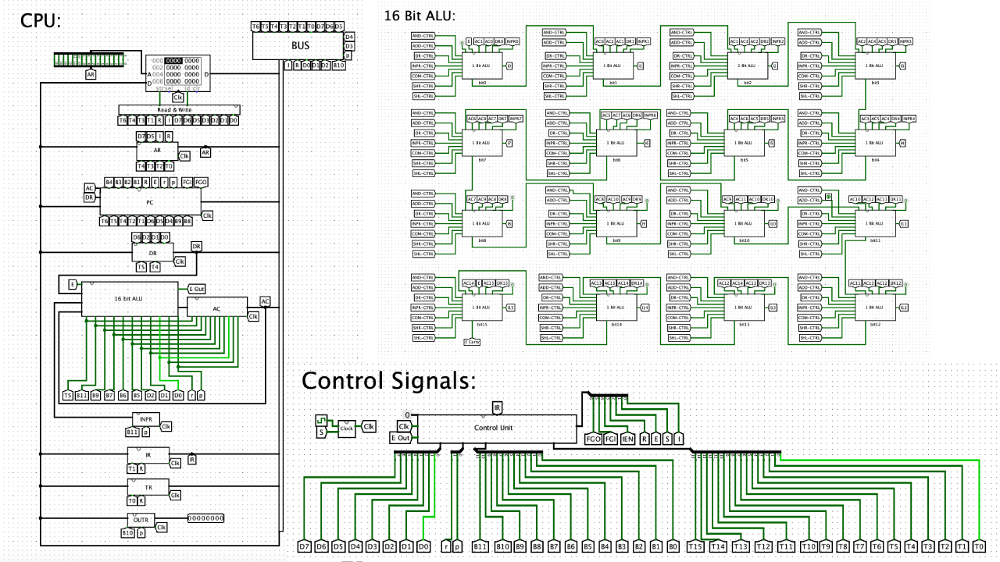

# 
 🧠🖥 Moris Mano Basic Computer In Logisim

*ps: In case you didn't get the emojis, this is a CPU which is considered the brain of the computer. :)

## Table of Contents
 * [About the Project](#about-the-project)
	 * [Built With](#built-with)
 * [Getting Started](#getting-started)
	 * [Prerequisites](#prerequisites)
* [Contact](#contact)

<!-- ABOUT THE PROJECT -->
## About The Project
This is a **Computer Organization** course project. The goal is to design **a functional CPU** containing ALU and other major parts.

The basic computer consists of the following hardware components:
1. A **memory unit** with 4096 words of 16 bits each  
2. Nine **registers**: AR, PC, DR, AC, IR, TR, OUTR, INPR, and SC  
3. Seven **flip-flops**: I, S, E, R, lEN, FGI, and FGO  
4. Two decoders: a 3 x 8 **operation decoder** and a 4 x 16 **timing decoder**
5. A 16-bit **common bus**  
6. **Control logic gates**  
7. **Adder and logic circuit** connected to the input of AC

The project got **full mark**.

### Built With
* [Logisim](http://www.cburch.com/logisim/)

<!-- GETTING STARTED -->
## Getting Started

### Prerequisites
- [Logisim](http://www.cburch.com/logisim/)

<!-- CONTACT -->
## Contact
If you have any further questions, please contact me via email.

Parisa Rabbany - Parisa.Rabbany.pr@gmail.com
